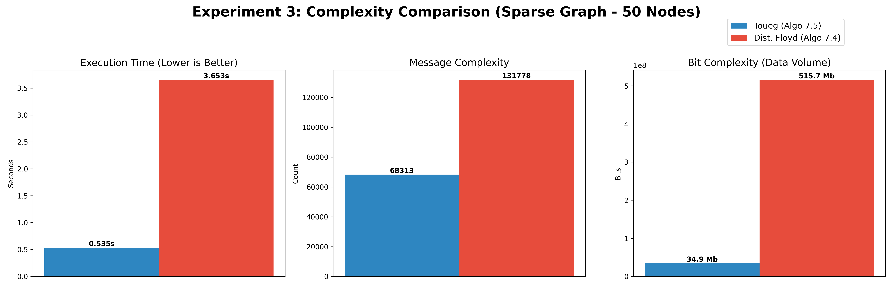
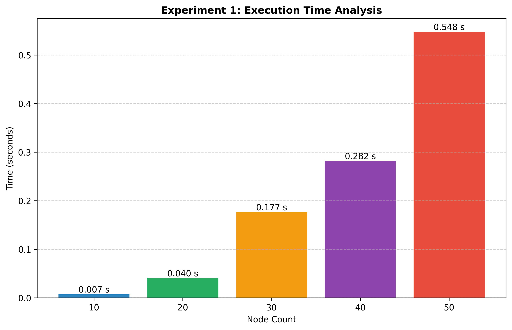

# Toueg vs Floyd: Routing Algorithm Evaluation in Distributed Systems

Bu proje, dağıtık sistemlerde kullanılan **Toueg's Routing Algorithm** ile klasik **Floyd-Warshall** algoritmasının performansını karşılaştırmalı olarak analiz eden bir simülasyon ve değerlendirme çalışmasıdır.

Proje, hem rastgele oluşturulmuş ağ topolojileri (Sparse/Dense) hem de gerçek dünya verileri (Havalimanı rotaları) üzerinde algoritmaların mesaj karmaşıklığını ve işlem sürelerini test eder.

## 🎯 Projenin Amacı
Dağıtık sistemlerde yönlendirme (routing) tablolarının oluşturulması maliyetli bir işlemdir. Bu çalışma şunları hedefler:
* **Toueg** ve **Floyd** algoritmalarının çalışma prensiplerini simüle etmek.
* Ağ yoğunluğunun (density) işlem süresine ve mesaj trafiğine etkisini ölçmek.
* Algoritmaların "All-Pairs Shortest Path" problemini çözerken harcadıkları kaynakları görselleştirmek.

## 📊 Analiz Sonuçları ve Görseller

Proje çıktılarından elde edilen bazı kritik analiz grafikleri:

### 1. Performans Karşılaştırması
Toueg ve Floyd algoritmalarının işlem süreleri ve mesaj karmaşıklıkları:



### 2. Zaman ve Karmaşıklık Analizi
Farklı düğüm sayılarında algoritmaların davranışları:

| Zaman Analizi | Mesaj Karmaşıklığı |
|ur|---|
|  |  |

### 3. Ağ Görselleştirme (Örnek Topoloji)
Simülasyonda kullanılan 10 düğümlü gerçek dünya (Real World) ağ örneği:


## 🛠 Kurulum ve Çalıştırma

Projeyi yerel makinenizde çalıştırmak için aşağıdaki adımları izleyin.

### Gereksinimler
Proje Python 3 üzerinde çalışır. Gerekli kütüphaneler:
* `networkx`
* `matplotlib`
* `pandas`
* `numpy`
   ```bh
   git clone [https://github.com/kullaniciadiniz/toueg-routing-evaluation.git](https://github.com/kullaniciadiniz/toueg-routing-evaluation.git)
   cd toueg-routing-evaluation
